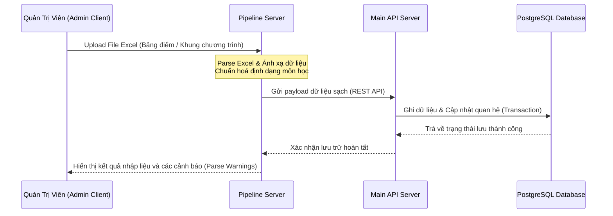

# 🧭 PATH_MINDED — Academic Path & Advisor Management Platform

<p align="center">
  
  
  
  
  
</p>

---

## 📝 Giới Thiệu

**PATH_MINDED** là một hệ sinh thái toàn diện hỗ trợ quản lý chương trình đào tạo, theo dõi tiến độ học tập, tự động hóa phân tích bảng điểm sinh viên và hỗ trợ cố vấn học tập đưa ra các cảnh báo học vụ kịp thời. 

Hệ thống được thiết kế theo mô hình phân rã dịch vụ với hiệu năng xử lý song song nhờ pipeline xử lý dữ liệu Excel riêng biệt, kết hợp hai ứng dụng Client chuyên biệt cho Quản trị viên (Admin) và Người dùng cuối (Sinh viên & Cố vấn).

---

## 🌟 Tính Năng Nổi Bật

- **📊 Pipeline Xử Lý Bảng Điểm Tự Động:** Đọc dữ liệu từ file Excel, chuẩn hoá thông tin, ánh xạ môn học tương đương/tiên quyết và phân tích tiến độ tích luỹ tự động.
- **🛡️ Quản Lý Phân Quyền Đa Dạng:** Phân quyền chặt chẽ giữa Quản trị viên hệ thống (Admin), Cố vấn học tập (Advisor), và Sinh viên (Student).
- **📈 Biểu Đồ Lộ Trình Học Tập:** Trực quan hóa tiến độ tích luỹ, các khối kiến thức bắt buộc/tự chọn và lộ trình môn học trực quan.
- **🚨 Cảnh Báo Học Vụ Tự Động:** Phát hiện sớm các trường hợp sinh viên có nguy cơ cảnh cáo học vụ, tụt giảm GPA hoặc chậm tiến độ dựa trên quy chế đào tạo.
- **🔌 API Gateway & Background Processing:** Tách biệt ứng dụng xử lý dữ liệu nặng (pipeline) ra khỏi API nghiệp vụ chính để đảm bảo tính sẵn sàng cao cho hệ thống.

---

## 📂 Cấu Trúc Dự Án

Hệ thống được tổ chức dưới dạng **Monorepo** với 4 thư mục chính tương ứng với các phân hệ độc lập:

```text
📂 PATH_MINDED
├── 📂 server/              # Backend API chính (NestJS + PostgreSQL)
│   ├── src/modules/        # Các module nghiệp vụ (users, students, classes,...)
│   └── database/           # Schema, migrations & seeders dữ liệu mẫu
├── 📂 pipeline_server/     # Service xử lý Excel & Pipeline chuẩn hóa dữ liệu (NestJS)
│   └── src/pipelines/      # Luồng xử lý import lớp học, khung chương trình, bảng điểm
├── 📂 admin_client/        # Single Page App cho Ban quản lý (React + Vite + TailwindCSS)
│   ├── src/components/     # UI components dùng chung (DataTable, Charts, Modals)
│   └── src/hooks/          # Custom hooks kết nối API admin
└── 📂 user_client/         # SSR Web App cho Sinh viên & Cố vấn (Next.js 15 App Router)
    ├── app/                # Các route theo kiến trúc Next.js (student, advisor, public)
    └── components/         # UI Components chuẩn Tailwind & shadcn
```

---

## 🛠️ Công Nghệ Sử Dụng

### Backend Ecosystem
- **Core Engine:** Node.js (v18+), TypeScript, NestJS.
- **Database:** PostgreSQL kết hợp thư viện query chuyên dụng.
- **Dịch vụ bổ trợ:** SheetJS (XLSX) xử lý phân tích file Excel hiệu năng cao.
- **Bảo mật:** JWT (JSON Web Tokens), Role-Based Access Control (RBAC).

### Frontend Ecosystem
- **Admin App:** React 18, Vite, Tailwind CSS, Lucide Icons.
- **User App:** Next.js 15, React 19, Tailwind CSS, Context API.
- **State Management & Call API:** Custom hooks tích hợp Axios.

---

## 🚀 Hướng Dẫn Cài Đặt & Khởi Chạy

### 📋 Yêu cầu hệ thống
- **Node.js:** `v18.x` hoặc `v20.x` trở lên.
- **Package Manager:** `npm` hoặc `yarn` / `pnpm`.
- **Database:** PostgreSQL 14+ đang hoạt động.

---

### 1️⃣ Cấu Hình & Chạy Backend (Main Server)

Vào thư mục `server`:
```bash
cd server
```

Tạo file `.env` dựa trên file cấu hình hoặc khai báo các biến môi trường sau:
```env
PORT=5000
DB_HOST=localhost
DB_PORT=5432
DB_USER=your_postgres_user
DB_PASSWORD=your_postgres_password
DB_NAME=path_minded_db
JWT_SECRET=your_super_secret_key
JWT_EXPIRES_IN=1d
```

Cài đặt các gói phụ thuộc và chạy ứng dụng:
```bash
# Cài đặt thư viện
npm install

# Khởi chạy chế độ Development
npm run start:dev

# Build ứng dụng cho Production
npm run build
```

---

### 2️⃣ Cấu Hình & Chạy Pipeline Server

Vào thư mục `pipeline_server`:
```bash
cd ../pipeline_server
```

Tạo file `.env` và thiết lập các kết nối cần thiết:
```env
PORT=5001
MAIN_SERVER_API=http://localhost:5000/api
# Thêm các cấu hình lưu trữ tạm thời nếu cần
```

Cài đặt các gói phụ thuộc và chạy ứng dụng:
```bash
npm install
npm run start:dev
```

---

### 3️⃣ Cấu Hình & Chạy Admin Client

Vào thư mục `admin_client`:
```bash
cd ../admin_client
```

Tạo file `.env` để trỏ API endpoint về Server chính:
```env
VITE_API_URL=http://localhost:5000/api
```

Cài đặt các gói phụ thuộc và khởi chạy:
```bash
npm install

# Chạy dev server tại http://localhost:5173
npm run dev

# Build production build
npm run build
```

---

### 4️⃣ Cấu Hình & Chạy User Client (Next.js)

Vào thư mục `user_client`:
```bash
cd ../user_client
```

Tạo file `.env.local`:
```env
NEXT_PUBLIC_API_URL=http://localhost:5000/api
```

Cài đặt các gói phụ thuộc và chạy dự án:
```bash
npm install

# Chạy môi trường Local tại http://localhost:3000
npm run dev

# Build & Start Production
npm run build
npm run start
```

---

## 📊 Quy Trình Hoạt Động Của Hệ Thống



---

## 🔒 Bản Quyền & Giấy Phép

Dự án này được phát hành dưới giấy phép **MIT License**. Bạn được tự do tùy chỉnh, phân phối và sử dụng cho mục đích cá nhân lẫn thương mại.

---
<p align="center">Được phát triển với ❤️ bởi đội ngũ <b>PATH_MINDED</b>.</p>
